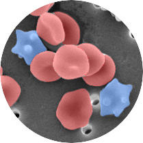
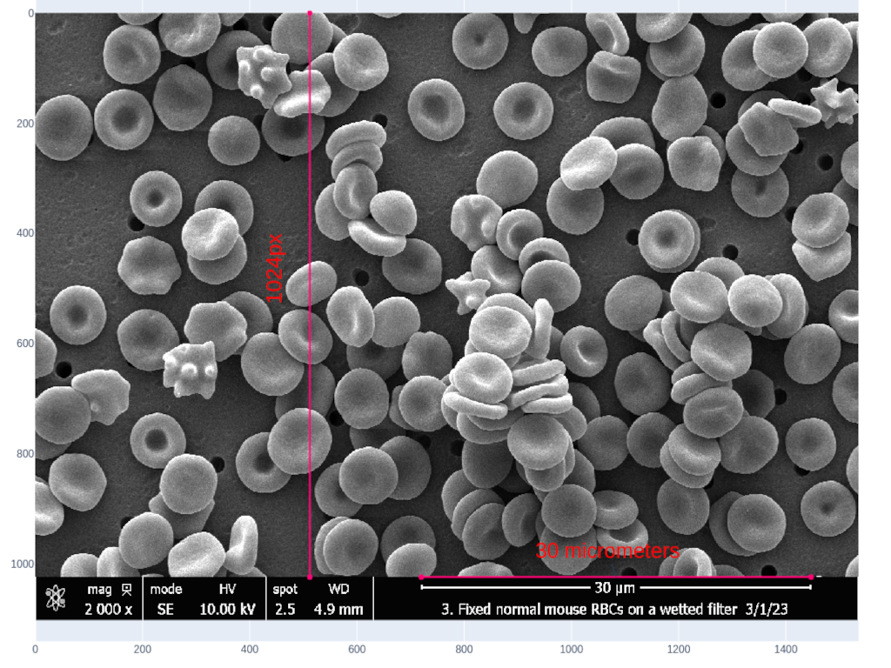
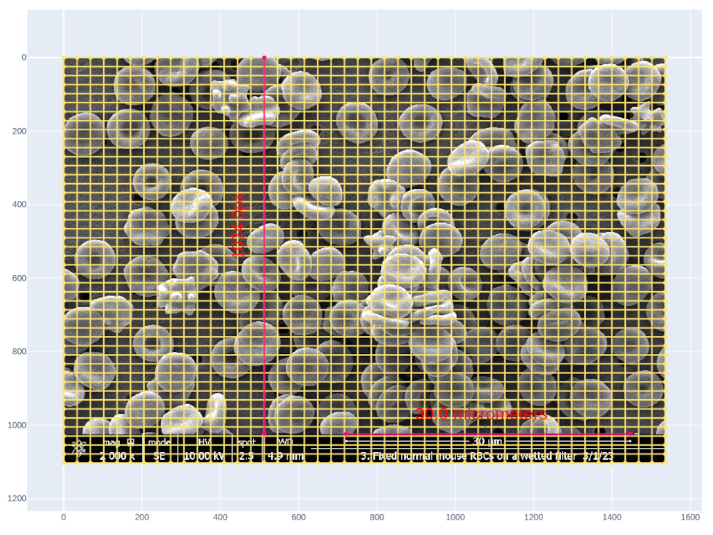
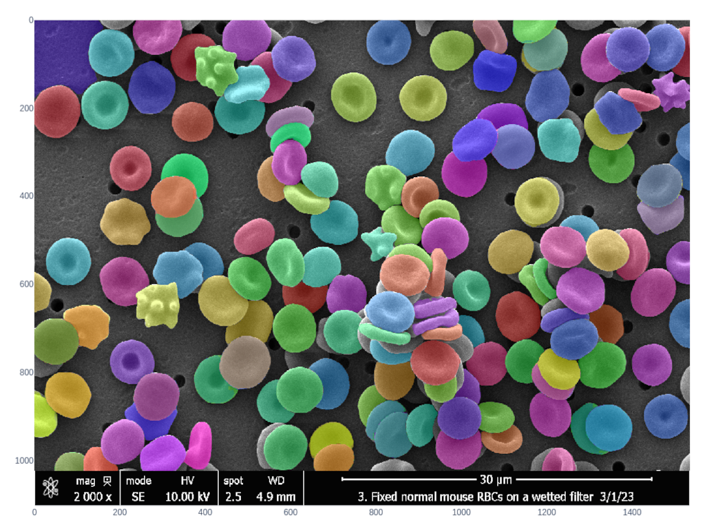
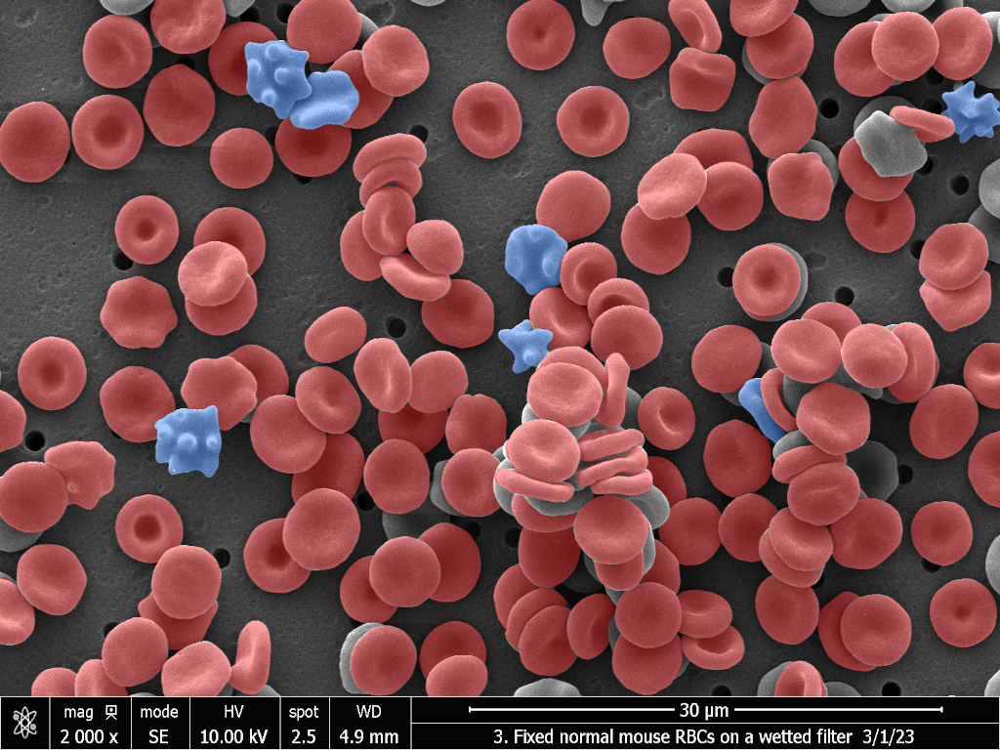
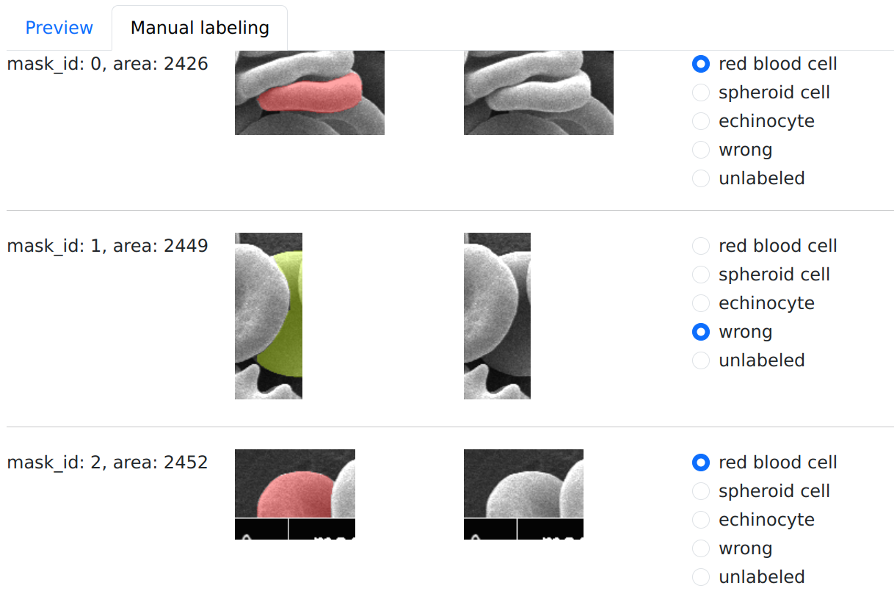
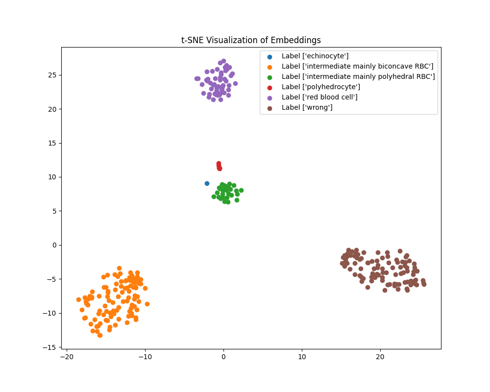
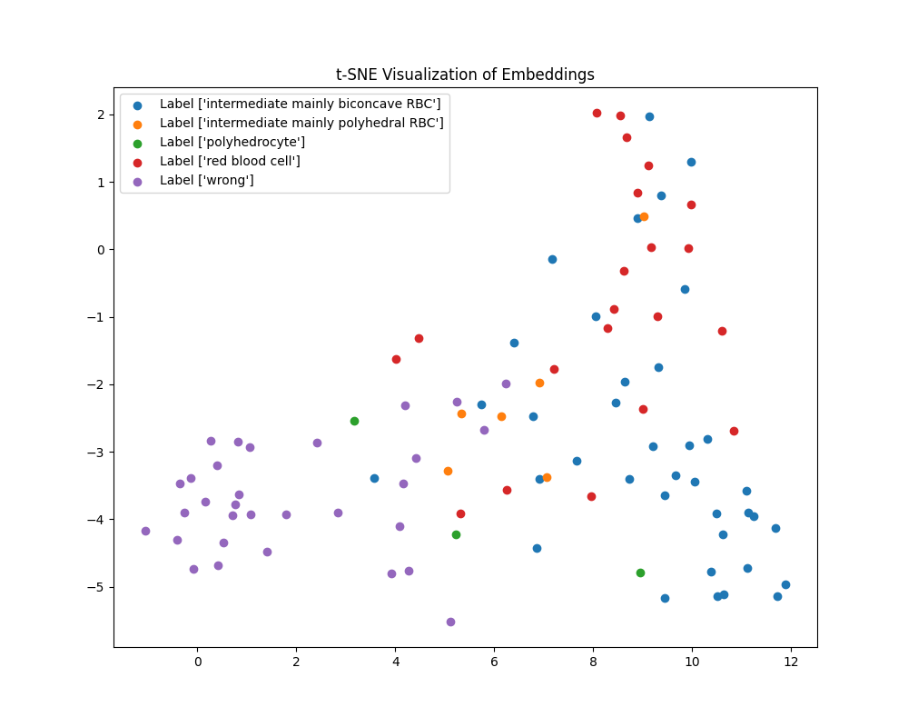

<h1 align="center">
   
  
   
  Cells Labeling Tool
   
</h1>

## Workflow

- The tool begins by extracting metadata from the bottom of the image using a measurement function, which also stores the image scaling factor.
- It then identifies objects within the image through the application of [SegmentAnything](https://github.com/facebookresearch/segment-anything), utilizing a customizable grid layout for segmentation.
- To enhance the classification accuracy, the tool employs a Human-in-the-Loop (HITL) approach, which involves:
    - Manually labeling several objects to establish initial training data.
    - Training a classifier model based on this labeled data.
    - Reviewing and correcting any inaccuracies in the classification results.
    - Repeating the training process with the corrected data to refine the classifier's performance.

    
&nbsp;
    

    
&nbsp;
    

## Features

### Output Statistics

| **Label**      | **Count** |
| -------------- | --------- |
| red blood cell | 133       |
| echinocyte     | 7         |
| wrong          | 23        |

### Customizable Labels

- Users have the flexibility to customize a set of labels according to their needs and train classifiers specifically for their projects.
- The tool allows for manual correction of misclassifications either by interacting with the masks preview or by individually reviewing and adjusting the masks.

## Classification Accuracy

During the development of our model, you can monitor its performance through both training and validation phases. The following visualizations illustrate the model's ability to accurately classify various instances across these stages.

